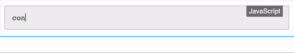

# CKEditor 5 code block feature

This package implements real-time syntax highlight basesd on the code block feature of CKEditor 5 and third party libary Highlight.js

## Usage

## Documentation

See the [`@ckeditor/ckeditor5-code-block` package](https://ckeditor.com/docs/ckeditor5/latest/api/code-block.html) page as well as the [Code block feature guide](https://ckeditor.com/docs/ckeditor5/latest/features/code-blocks.html) in [CKEditor 5 documentation](https://ckeditor.com/docs/ckeditor5/latest/).

## License

Licensed under the terms of [GNU General Public License Version 2 or later](http://www.gnu.org/licenses/gpl.html). For full details about the license, please check the `LICENSE.md` file or [https://ckeditor.com/legal/ckeditor-oss-license](https://ckeditor.com/legal/ckeditor-oss-license).
